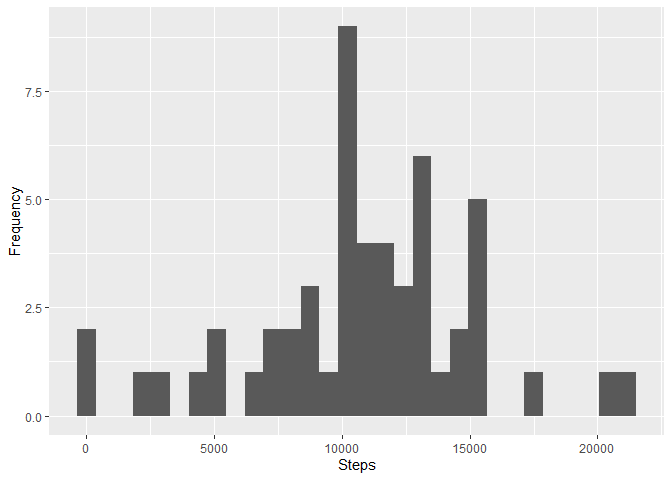
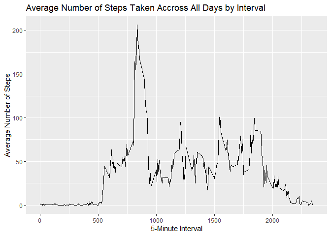
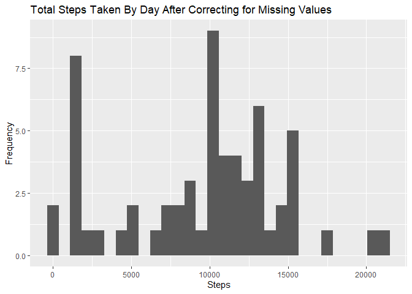
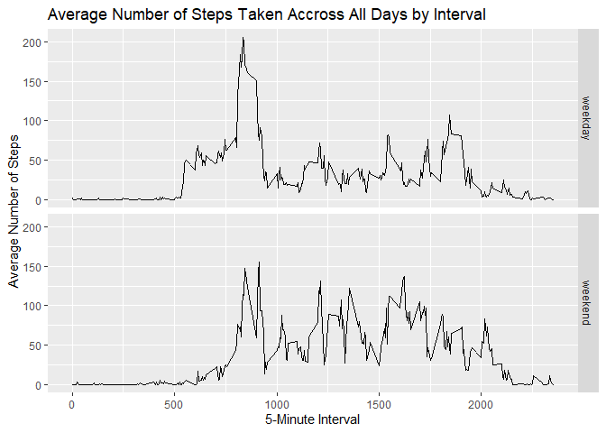

## Data

The data for this assignment can be downloaded from the course web
site:

* Dataset: [Activity monitoring data](https://d396qusza40orc.cloudfront.net/repdata%2Fdata%2Factivity.zip) [52K]

The variables included in this dataset are:

* **steps**: Number of steps taking in a 5-minute interval (missing
    values are coded as `NA`)

* **date**: The date on which the measurement was taken in YYYY-MM-DD
    format

* **interval**: Identifier for the 5-minute interval in which
    measurement was taken


## Load packages

```r
library(tidyverse)
```

## Load the data

```r
download.file("https://d396qusza40orc.cloudfront.net/repdata%2Fdata%2Factivity.zip", "activitydata.zip")
unzip("activitydata.zip")
activity <- read_csv("activity.csv")
```

## What is mean total number of steps taken per day?  
First a data frame with total steps per day is created and then plotted. Mean and median values are reported below.


```r
activity.bydate <- activity %>%
  drop_na() %>%
  group_by(date) %>%
  summarise(steps = sum(steps))

activity.bydate %>%
  ggplot(aes(x = steps)) +
  geom_histogram(bins = 30) +
  labs(x = "Steps", y = "Frequency")
```

<!-- -->

```r
step.mean <- mean(activity.bydate$steps)
step.median <- median(activity.bydate$steps)
```

The mean number of steps per day is 10766.1886792 and the median number of steps per day is 10765.

## What is the average daily activity pattern?
First a data frame with average steps taken per interval across all days is created and the plotted. The interval containing the max value is reported below.


```r
activity.byint <- activity %>%
  group_by(interval) %>%
  summarize(stepavg = mean(steps, na.rm = TRUE))
  
activity.byint %>%
  ggplot(aes(x = interval, y = stepavg)) +
  geom_line() +
  labs(x = "5-Minute Interval", 
       y = "Average Number of Steps") +
  ggtitle("Average Number of Steps Taken Accross All Days by Interval")
```

<!-- -->

```r
maxint <- activity.byint[which.max(activity.byint$stepavg),]
```

The 5-five minute interval that contains the maximum steps averaged across all days is 835 with 206.1698113 average steps taken.

## Imputing missing values


```r
na.len <- length(activity$steps)-sum(complete.cases(activity))
```

There are 2304 incomplete rows in the data set (i.e. the row contains NA). In order to impute missing values, the median value for the interval the NA measurement occurs on is used to replace the NA value.


```r
# create temporary data frame that adds a column with median steps across intervals

impute <- activity %>%
  group_by(interval) %>%
  mutate(med = median(steps, na.rm = TRUE))

# replace all missing values with median value from above
impute[is.na(activity$steps),"steps"] <- impute$med[is.na(activity$steps)]

activity.complete <- select(impute, date, steps, interval)

activity.complete.bydate <- activity.complete %>%
  drop_na() %>%
  group_by(date) %>%
  summarise(steps = sum(steps))

activity.complete.bydate %>%
  ggplot(aes(x = steps)) +
  geom_histogram(bins = 30) +
  labs(x = "Steps", y = "Frequency") + 
  ggtitle("Total Steps Taken By Day After Correcting for Missing Values")
```

<!-- -->

```r
stepnew.mean <- mean(activity.complete.bydate$steps)
stepnew.median <- median(activity.complete.bydate$steps)

meandiff <- step.mean - stepnew.mean
mediandiff <- step.median - stepnew.median
```

After replacing missing values with the interval's median value, the mean number of steps per day is 9503.8688525 and the median number of steps per day is 10395. These differ from the original data set by 1262.3198268 and 370 respectively. This imputing strategy increased the mean and median by a non trivial amount suggesting an alternative strategy might be considered.

## Are there differences in activity patterns between weekdays and weekends?
The new, imputed data is ammended to include a factor indicating if the data occurs on a weekend or weekday. A new data frame with the average number of steps across all days by interval and day type is created and plotted.


```r
weekday <- c("Monday", "Tuesday", "Wednesday", "Thursday", "Friday")
weekend <- c("Saturday", "Sunday")

activity.complete <- activity.complete %>%
  mutate(day = weekdays(date))

# add column with day type factor
activity.complete$daytype[activity.complete$day %in% weekday] <- "weekday"
activity.complete$daytype[activity.complete$day %in% weekend] <- "weekend"

activity.complete.byint <- activity.complete %>%
  group_by(interval,daytype) %>%
  summarize(stepavg = mean(steps, na.rm = TRUE))
  
activity.complete.byint %>%
  ggplot(aes(x = interval, y = stepavg)) +
  geom_line() +
  facet_grid(rows = vars(daytype)) +
  labs(x = "5-Minute Interval", 
       y = "Average Number of Steps") +
  ggtitle("Average Number of Steps Taken Accross All Days by Interval")
```

<!-- -->
